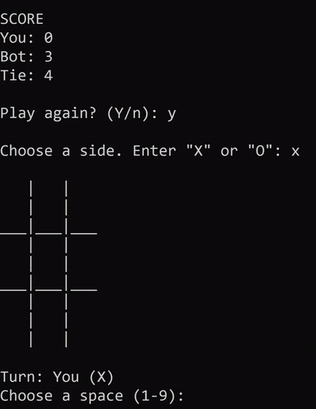

#### An unbeatable Tic-Tac-Toe console game written in C# using object oriented programming principles.

### Description
The game allows the user to pick a side (either X or O) and will give control to the remaining side to an adversary bot player. After each game, the user is able to continue playing while a displayed score keeps track of the results of previous games.

The code is easy to update and maintain due to its modularization by using classes for the Game, Board, Space, Player, and BotAI. These object-oriented principles allows the program to keep state on each of its objects, making it simple to debug by being able to access the details of every object at any point.

The bot plays smart moves, **making it impossible to be beaten**.

### How is it unbeatable?
Through an implementation of the [minimax algorithm](https://en.wikipedia.org/wiki/Minimax), the bot's artificial intelligence looks ahead and always chooses the best possible move. The algorithm works by iterating over each space of the board and simulating the move, then it will assume the opponent (you) will also choose the best possible move. This process is repeated recursively until a terminal state is reached (win/lose/tie), where the initial move will be graded depending on the result that it led to. Finally, the bot will analyze the results to choose the move that will provide it with the best outcome.

By performing this analysis for every move the bot makes, the human player can only expect to get to a tie if the game is played optimally from his/her side.

